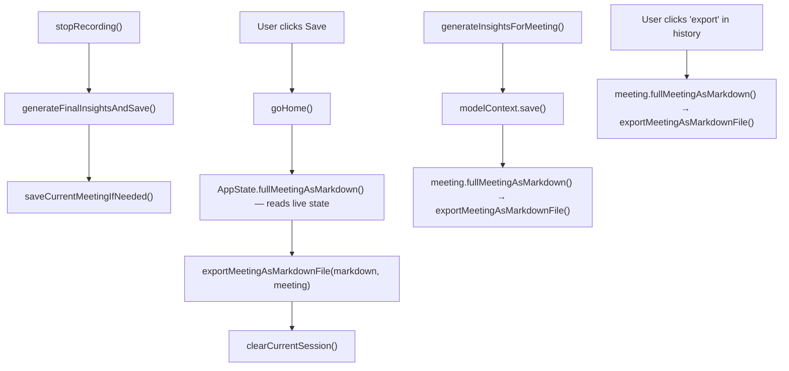

# Auto-Export Meetings as Markdown Files (macOS)

## What changes

When enabled in Settings, every finalized meeting is written as a `.md` file to a local folder. One file per meeting, containing notes, insights (standard + MEDDPICC), training metrics, and then the full transcript at the end. Designed for Obsidian vaults, Claude Code project folders, and similar dev-friendly workflows.

Optionally, a `CLAUDE.md` index file is maintained in the export folder so AI agents can discover and work with the exported meetings.

## Key design decisions

- **macOS only** — desktop feature. All new `@AppStorage` keys, the export function, trigger-point calls in `goHome()` and `generateInsightsForMeeting()`, and Settings UI are guarded with `#if os(macOS)` in shared files (`AppState.swift`)
- **Opt-in toggle** in General Settings with a folder picker (default: `~/Documents/miniti/`)
- **No sandbox** (DMG distribution), so a plain path string in `@AppStorage` is sufficient — no security-scoped bookmarks needed
- **Filename format**: `YYYY-MM-DD-HHmm-title.md` — no spaces, lowercase, all non-alphanumeric characters (except `-`) replaced with `-`, consecutive dashes collapsed. Dev-friendly for shell, Obsidian, and git. Example: `2026-03-25-1030-product-sync.md`
- **Overwrites** on re-export — filename is deterministic from `meeting.startTime` + `meeting.title`. Known limitation: renaming a meeting after export orphans the old file (acceptable for v1)
- **Transcript goes last** — the file leads with notes, insights, MEDDPICC, and training metrics so agents and readers see the high-value content first without scrolling through raw transcript
- **Training metrics** are computed on the fly from segments (same as history views do today)
- **No data loss on `goHome()` export** — the markdown string is built from live in-memory `AppState` data (`liveSegments`, `liveNotes`, `trainingMetrics`, live insight fields) synchronously *before* `clearCurrentSession()`, avoiding the async save queue timing issue entirely. Historical re-exports (from `generateInsightsForMeeting` and the manual button) read from the persisted `Meeting` model.
- **Optional `CLAUDE.md` index** — a second Settings toggle generates a `CLAUDE.md` in the export folder listing all exported meetings with filenames, dates, and titles. Updated on every export. Designed for AI agents (Claude Code, Cursor, etc.) to discover meeting context.

## Todos

1. Add `trainingMetricsAsMarkdown()` to `Meeting.swift`, update `fullMeetingAsMarkdown()` to include training and move transcript to the end
2. Update `AppState.fullMeetingAsMarkdown()` to include training metrics and move transcript to the end (mirrors Meeting version, reads from live state)
3. Add `@AppStorage` keys for `autoExportMarkdown`, `markdownExportFolderPath`, and `generateClaudeMd` in `AppState` (inside `#if os(macOS)`)
4. Add `exportMeetingAsMarkdownFile(markdown:meeting:)` in `AppState` — takes a pre-built markdown string + meeting (for filename metadata), writes file, optionally updates `CLAUDE.md` index
5. In `goHome()`: build markdown from `AppState.fullMeetingAsMarkdown()` synchronously, then pass to export *before* `clearCurrentSession()` (guarded with `#if os(macOS)`)
6. In `generateInsightsForMeeting()`: call `meeting.fullMeetingAsMarkdown()` and pass to export after `modelContext.save()` (guarded with `#if os(macOS)`)
7. Add "export" button to `MeetingDetailView` in `MainWindow.swift` — manual per-meeting export from history
8. Add Export section to `GeneralSettingsView` with toggle, `CLAUDE.md` toggle, folder picker, and path display
9. Fix pre-existing bug: `AppState.fullMeetingAsMarkdown()` uses `Date()` instead of `currentMeeting?.startTime`
10. Update `CLAUDE.md` changelog and architecture notes

## File changes

### 1. Miniti/Models/Meeting.swift — add training section, reorder to put transcript last

Add `trainingMetricsAsMarkdown()` that computes `TrainingMetrics.compute(from:duration:)` from the meeting's segments (duration = `endTime?.timeIntervalSince(startTime) ?? 0`) and formats key metrics per speaker: fillers/min, talk ratio, pace, longest monologue, questions, clarity.

Update `fullMeetingAsMarkdown()` to reorder sections and include training:

```swift
func fullMeetingAsMarkdown() -> String {
    var md = "# \(title)\n\n"
    md += "_\(startTime.formatted(date: .long, time: .shortened))_\n\n"
    md += "---\n\n"
    // Notes first (if any)
    if !notes.isEmpty {
        md += notesAsMarkdown()
        md += "\n\n---\n\n"
    }
    // Insights (summary, discussion, actions, topics, MEDDPICC)
    md += insightsAsMarkdown()
    md += "\n\n---\n\n"
    // Training metrics
    md += trainingMetricsAsMarkdown()
    md += "\n\n---\n\n"
    // Transcript last
    md += transcriptAsMarkdown()
    return md
}
```

### 2. Miniti/Models/AppState.swift — export function + settings + trigger points + reorder live markdown

**Update `AppState.fullMeetingAsMarkdown()`**: fix the `Date()` bug (use `currentMeeting?.startTime`), add training metrics section, reorder to match Meeting version (notes → insights → training → transcript last).

**New `@AppStorage` properties (inside `#if os(macOS)`):**

- `@AppStorage("autoExportMarkdown") var autoExportMarkdown: Bool = false`
- `@AppStorage("markdownExportFolderPath") var markdownExportFolderPath: String = ""` (empty = default `~/Documents/miniti/`)
- `@AppStorage("generateClaudeMd") var generateClaudeMd: Bool = false`

**New function** `exportMeetingAsMarkdownFile(markdown: String, meeting: Meeting)`:

- Takes a pre-built markdown string (avoids async timing issues — caller decides the data source)
- Resolves the folder path (uses default `~/Documents/miniti/` if empty), creates directory if needed
- Builds filename: format meeting `startTime` as `yyyy-MM-dd-HHmm`, append `-`, append sanitized title (lowercased, non-alphanumeric replaced with `-`, consecutive dashes collapsed, leading/trailing dashes stripped), append `.md`
- Writes the markdown string to disk (overwrites if file exists)
- If `generateClaudeMd` is true, calls `updateClaudeMdIndex()` to rebuild the `CLAUDE.md` file
- Logs success/failure via `DebugLogger`

**New function** `updateClaudeMdIndex()`:

- Scans the export folder for `.md` files (excluding `CLAUDE.md` itself)
- Builds an index file with a header explaining the folder contents and a list of meetings with filenames, dates, and titles
- Writes `CLAUDE.md` to the export folder root

**Trigger point 1 — `goHome()` (inside `#if os(macOS)`):**

```swift
// Before clearCurrentSession():
#if os(macOS)
if autoExportMarkdown, let meeting = currentMeeting {
    let markdown = fullMeetingAsMarkdown()  // reads live AppState data synchronously
    exportMeetingAsMarkdownFile(markdown: markdown, meeting: meeting)
}
#endif
clearCurrentSession()
```

This reads from `liveSegments`, `liveNotes`, `trainingMetrics`, and all live insight fields — no dependency on the async save queue.

**Trigger point 2 — `generateInsightsForMeeting(_ meeting:)` (inside `#if os(macOS)`):**

```swift
// After modelContext.save() on line ~1685:
#if os(macOS)
if autoExportMarkdown {
    let markdown = meeting.fullMeetingAsMarkdown()  // reads from persisted Meeting model
    exportMeetingAsMarkdownFile(markdown: markdown, meeting: meeting)
}
#endif
```



### 3. Miniti/Views/MainWindow.swift — per-meeting "export" button in history

Add an "export" button to `MeetingDetailView` (near the existing "send to attio" button area). Calls `meeting.fullMeetingAsMarkdown()` and passes to `appState.exportMeetingAsMarkdownFile(markdown:meeting:)`. The button should be visible regardless of the auto-export toggle — it's a manual action.

### 4. Miniti/Views/SettingsView.swift — UI in General Settings

Add an "Export" section to `GeneralSettingsView` with:

- Toggle: "Auto-export meetings as markdown"
- Toggle: "Generate CLAUDE.md index" (only shown when auto-export is on)
- Current folder path display (dimmed monospace text)
- "Choose Folder" button — opens `NSOpenPanel` directory picker, stores selected path
- Caption: "Automatically saves each meeting as a markdown file. Works with Obsidian, Claude Code, and other tools."

### 5. CLAUDE.md — update changelog + architecture notes

Add changelog entry and document the new `@AppStorage` keys, export behavior, and `CLAUDE.md` index generation.

## Filename examples

| Meeting | Filename |
|---|---|
| "Product sync" at 2026-03-25 10:30 | `2026-03-25-1030-product-sync.md` |
| "Q2 Roadmap / Planning" at 2026-03-25 14:00 | `2026-03-25-1400-q2-roadmap-planning.md` |
| "1:1 with Sarah (weekly)" at 2026-03-26 09:15 | `2026-03-26-0915-1-1-with-sarah-weekly.md` |
| "new" (default title) at 2026-03-26 11:00 | `2026-03-26-1100-new.md` |

## What the `CLAUDE.md` index looks like

```markdown
# Miniti Meeting Notes

This folder contains auto-exported meeting notes from [Miniti](https://miniti.app).

Each file contains notes, AI-generated insights (summary, discussion flow, action items, topics, MEDDPICC analysis), training metrics (filler words, pace, talk ratio, clarity), and the full transcript.

## Meetings

- [2026-03-25-1030-product-sync.md](2026-03-25-1030-product-sync.md) — March 25, 2026 — Product sync
- [2026-03-25-1400-q2-roadmap-planning.md](2026-03-25-1400-q2-roadmap-planning.md) — March 25, 2026 — Q2 Roadmap / Planning
- [2026-03-26-0915-1-1-with-sarah-weekly.md](2026-03-26-0915-1-1-with-sarah-weekly.md) — March 26, 2026 — 1:1 with Sarah (weekly)
```

## What the exported meeting file looks like

```markdown
# Product sync

_March 25, 2026 at 10:30 AM_

---

## Notes

Follow up on timeline with engineering.

---

## Insights

### Summary
...

### Discussion Flow
1. ...

### Action Items
- [ ] ...

### Topics
- ...

### MEDDPICC
**Metrics:** ...
**Economic Buyer:** ...

---

## Training

**Duration:** 32.5 min | **Talk Ratio (You):** 62%

### You
- Pace: 142 wpm
- Fillers: 3.2/min (um: 45, like: 12, ...)
- Longest monologue: 287 words
- Questions asked: 8
- Clarity: 18 words/turn

### Speaker 2
- Pace: 128 wpm
- ...

---

## Transcript

**You:**
Let's review the Q2 roadmap...

**Speaker 2:**
Sure, I have the updated timeline...
```
